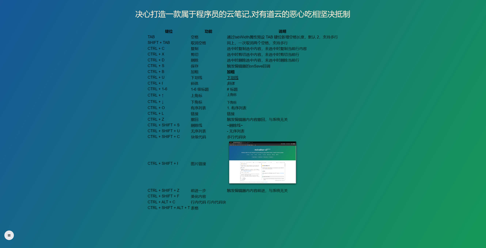

<p align="center">
	
</p>
<h1 align="center" style="margin: 30px 0 30px; font-weight: bold;">云笔记 </h1>
<h6 align="center" style="margin: 30px 0 30px;">基于若依v3.8.6</h6>
<h4 align="center">基于SpringBoot+Vue前后端分离的Java云笔记</h4>
<p align="center">
	<a href="https://gitee.com/y_project/RuoYi-Vue/stargazers"></a>
	<a href="https://gitee.com/y_project/RuoYi-Vue"></a>
	<a href="https://gitee.com/y_project/RuoYi-Vue/blob/master/LICENSE"></a>
</p>

## 平台简介

决心打造一款属于程序员的云笔记,对有道云的恶心吃相坚决抵制,免费提供给个人和企业使用

* 前端采用Vue、Element UI、md-editor-v3。
* 后端采用Spring Boot、Spring Security、Redis & Jwt。
* 权限认证使用Jwt，支持多终端认证系统。
* 支持加载动态权限菜单，多方式轻松权限控制。
* 高效率开发，使用代码生成器可以一键生成前后端代码。
*

提供了技术栈（[Vue3](https://v3.cn.vuejs.org) [Element Plus](https://element-plus.org/zh-CN) [Vite](https://cn.vitejs.dev)
）版本[RuoYi-Vue3](https://github.com/yangzongzhuan/RuoYi-Vue3)，保持同步更新。

## 内置功能

1. 用户管理：用户是系统操作者，该功能主要完成系统用户配置。
2. 部门管理：配置系统组织机构（公司、部门、小组），树结构展现支持数据权限。
3. 岗位管理：配置系统用户所属担任职务。
4. 菜单管理：配置系统菜单，操作权限，按钮权限标识等。
5. 角色管理：角色菜单权限分配、设置角色按机构进行数据范围权限划分。
6. 字典管理：对系统中经常使用的一些较为固定的数据进行维护。
7. 参数管理：对系统动态配置常用参数。
8. 通知公告：系统通知公告信息发布维护。
9. 操作日志：系统正常操作日志记录和查询；系统异常信息日志记录和查询。
10. 登录日志：系统登录日志记录查询包含登录异常。
11. 在线用户：当前系统中活跃用户状态监控。
12. 定时任务：在线（添加、修改、删除)任务调度包含执行结果日志。
13. 代码生成：前后端代码的生成（java、html、xml、sql）支持CRUD下载 。
14. 系统接口：根据业务代码自动生成相关的api接口文档。
15. 服务监控：监视当前系统CPU、内存、磁盘、堆栈等相关信息。
16. 缓存监控：对系统的缓存信息查询，命令统计等。
17. 在线构建器：拖动表单元素生成相应的HTML代码。
18. 连接池监视：监视当前系统数据库连接池状态，可进行分析SQL找出系统性能瓶颈。

## 使用方法

1. vue编译打包
2. 配置mysql, 配置redis,配置mongodb
3. 后台代码打包
4. 将编译好的前端代码放入到nginx中的html文件夹下
5. 配置nginx的nginx.conf文件
   ```
     http {
      include       mime.types;
      default_type  application/octet-stream;

      sendfile        on;
      #tcp_nopush     on;
      keepalive_timeout  65;

      upstream nginx-cluster{
          server 192.168.150.101:8081;
      }
     server {
          listen       80;
          server_name  localhost;

          location / {
              root   html;
              index  index.html;
              try_files $uri $uri/ /index.html;#这边一定要加上否则会出现404
          }
        
          location /prod-api/{
              proxy_pass http://localhost:8080/;#后台服务地址
          }

          error_page   500 502 503 504  /50x.html;
          location = /50x.html {
              root   html;
          }
      }
   }   
   ```

6.启动nginx即可

## 演示图



